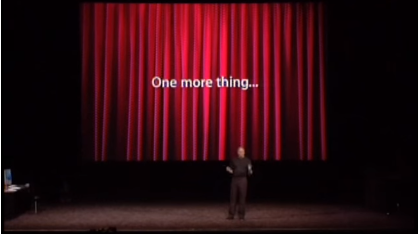

# 스티브잡스의 프레젠테이션 (2006)

김경태 지음(2004.12.30.). *스티브잡스의 프레젠테이션*. 대한민국: ㈜멘토르출판사.

[Special Event 2005](https://youtu.be/Sai2P6B7sys)

```
- 프레젠테이션이 아닌 하나의 완벽한 드라마
- 몸짓 하나 하나까지 연출된 치밀한 구성력
- 핵심만 보여주는 강력한 'One Point' 슬라이드
- 청중을 위한 쇼, 예상치 못한 이벤트
- 슬라이드와 하나가 된 엔터테이너 잡스의 진행력
- 이해도를 높이는 꼬리의 꼬리를 무는 화법
```

"노동은 인생의 대부분을 차지합니다. 그런 거대한 시간 속에서 진정한 기쁨을 누릴 수 있는 방법은 스스로가 위대한 일을 한다고 자부하는 것입니다. 자신의 일을 위대하다고 자부할 수 있는 떄는, 사랑하는 일을 하고 있는 그 순간뿐입니다. 지금도 찾지 못했거나, 잘 모르겠다고 해도 주저앉지 말고 포기하지 마세요. 전심을 다하면 반드시 찾을 수 있습니다." - Steve Jobs

- Persuation + Influence = 고객에 대한 설득과 영향을 주는 것
- 장점과 기능에서 → 고객에게 어떤 의미가 있는 지
- 프레젠테이션은 한 편의 잘 짜여진 드라마처럼




## 1. 좋은 프레젠테이션 요소

"핵심을 살리려면 덜 중요한 것들을 제거해야 한다. 디자이너들은 숨기고, 감추는 것의 미학을 지켜야 한다. 모든 것을 보여 주려고 하면, 결국 모든 것을 잃고 말기 때문이다." - 코이치 가와나

- 단순화
- 치밀함
- 간결함
- 함축성
- 자연스러움
- 여백
- 편안함
- 삭제


### 1.1. 추상화

- 메세지를 가급적 단순화 시킨다.
- 이 슬라이드에서 전달해야 할 핵심 메세지는 무엇일까?
- 슬라이드 안에 불필요한 요소는 없는가?

- 이 슬라이드에서 청중에게 무엇을 남겨야 할까?


### 1.2. No Slide

잡스의 프레젠테이션에는 아무것도 없는 '적절한 어둠'이 자주 등장합니다. 뭔가 스토리를 이야기할 때면 스크린은 어김없이 이런 상태가 됩니다. 재즈 거장들의 진가는 악보에 없는 애드리브 연주 부분에서 발휘됩니다. 악보와 악보 사이의 막간이 하이라이트가 되는 것입니다. 프레젠터의 진가 역시 스크린에 아무것도 없는 'No Slide' 상태에서 발휘됩니다.


### 1.3. Death by PowerPoint

1. 불필요하게 긴 프레젠테이션 시간
2. 단조로운 톤으로 슬라이드를 읽어 내려가는 프레젠터
3. 그래픽 요소 없이 평범한 텍스트로만 가득 찬 슬라이드
4. 모든 텍스트마다 애니메이션과 소리가 담긴 슬라이드
5. 너무 작고, 읽기도 어려운 내용으로 꾸며진 슬라이드


## 2. Attitude

_"You can never over-rehearse, 세상에 너무 많은 리허설이란 없다."_

- 제스처
- 단문과 반복
- 열정
- 호흡


### 2.1. 항상 되짚어 주고, 요약하라

매 페이지, 매 주제, 매 챕터, 매 프레젠테이션마다 반드시 하나의 설명이 끝나고 나면 그것을 요약합니다.

또한 3-Step 스피치 구성을 통해 반복, 통일을 시킵니다.


### 2.2. 정리

- 청중에게 맞는 메세지
- 넘치는 열정과 에너지
- 프레젠터를 따라오는 슬라이드
- 청중을 위한 쇼
- 최소한의 텍스트
- 빈 화면을 활용
- 커다란 폰트
- 글머리 기호의 자제
- 시각적 효과를 노리는 이미지 사용
- 차트나 그래프트는 최대한 단순하게
- 3-Step 스피치
- 제3자의 보증을 활용
- 드라마틱한 스토리
- 프로그램 데모는 스스로
- 뜻밖의 게스트
- 청중의 시각에서
- 지루하지 않은 비디오
- 대화하듯 자연스럽게
- 섹션 구성은 가급적 짧게
- 하이라이트는 마지막에
- 모든 공은 직원들에게
